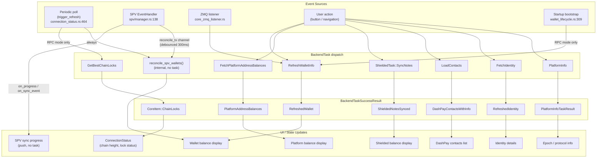
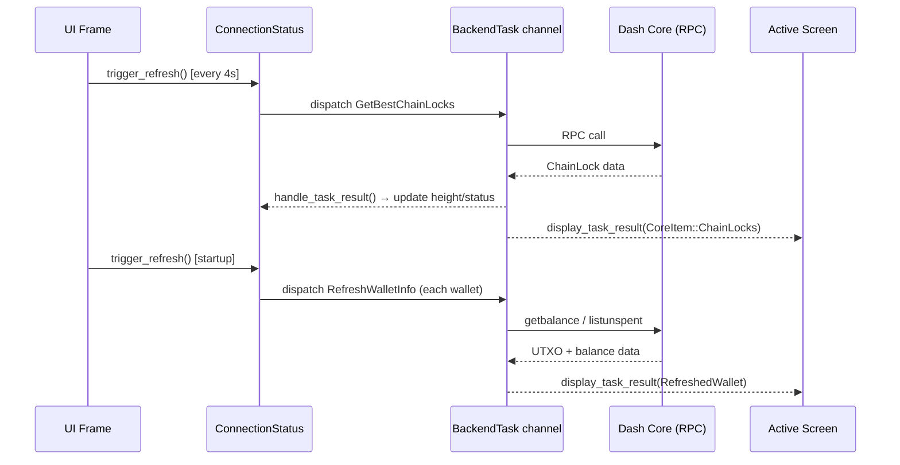
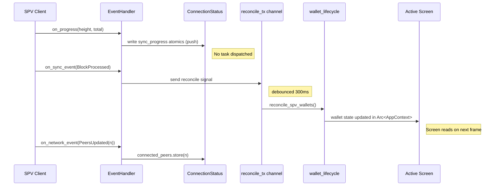
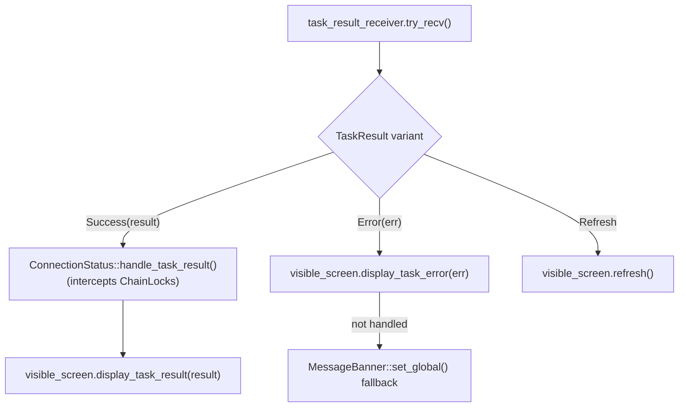

# Refresh & Event Dependency Graph

**Date:** 2026-04-01
**Audience:** Developers reviewing the refresh/event architecture

This document maps every event source to its downstream refresh targets, showing the routing path through tasks, result channels, and screen handlers. Use it as a reference when debugging stale UI data, duplicate refreshes, or mode-specific gaps.

---

## 1. Overview

The app has two distinct connection modes with different event models:

- **RPC mode** — periodic polling via `GetBestChainLocks`, wallet data fetched on demand
- **SPV mode** — push-based events from the SPV client; no RPC polling; wallet UTXOs reconciled from SPV storage

Both modes share the same `AppAction` → `BackendTask` → `TaskResult` channel pipeline.

---

## 2. Event Sources

### 2.1 Periodic Polling — `ConnectionStatus::trigger_refresh()`

**Location:** `src/context/connection_status.rs:464–491`

Called on every UI frame; throttled by elapsed time:

| Condition | Interval |
|---|---|
| Connected | 4 s (`REFRESH_CONNECTED`) |
| Disconnected | 1 s (`REFRESH_DISCONNECTED`) |
| SPV stopping | 200 ms |

On each tick:
- **RPC mode:** dispatches `GetBestChainLocks` → updates `ConnectionStatus` with chain height and lock data
- **SPV mode:** no RPC dispatch; all chain data arrives via push (see §2.2)
- **Always:** calls `refresh_zmq_and_spv()` to recompute `overall_state` from ZMQ and SPV atomics

### 2.2 SPV EventHandler — `spv/manager.rs`

**Location:** `src/spv/manager.rs:138–308`

Three callback types, each writing directly to `ConnectionStatus` atomics:

| Callback | Trigger | Effect |
|---|---|---|
| `on_progress()` | Block sync progress | Updates `sync_progress_state`, sets status `Syncing` / `Running` / `Error` |
| `on_sync_event()` | `SyncComplete`, `BlockProcessed`, `ManagerError`, `InstantLock`, `ChainLock` | Forwards finality events; sends on `reconcile_tx` channel (→ wallet reconciliation) |
| `on_network_event()` | `PeersUpdated` | Writes `connected_peers` count to `ConnectionStatus` |

`SyncComplete` sets status to `Running`; `ManagerError` sets it to `Error`.

### 2.3 SPV Reconciliation — `wallet_lifecycle.rs`

**Location:** `src/context/wallet_lifecycle.rs:679–717`

Triggered by the `reconcile_tx` channel whenever `on_sync_event` fires for:
`BlockProcessed` | `ChainLockReceived` | `InstantLockReceived` | `SyncComplete`

- Debounced 300 ms to coalesce rapid block events
- Calls `reconcile_spv_wallets()` — reads UTXOs/balances directly from SPV storage and updates wallet state in memory (no `BackendTask` roundtrip)

### 2.4 ZMQ Events — `core_zmq_listener.rs`

| Event | Effect |
|---|---|
| `ISLockedTransaction` | Direct wallet transaction update |
| `ChainLockedBlock` | Direct wallet update for chain-locked transactions |

### 2.5 Manual User Actions

| Trigger | Task dispatched |
|---|---|
| Refresh button (wallet screen) | `RefreshWalletInfo` |
| Refresh button (platform screen) | `FetchPlatformAddressBalances` |
| Network switch | `change_context()` on all screens → `refresh_on_arrival()` |
| Screen navigation (arrival) | `refresh_on_arrival()` (screen-dependent) |
| Post-operation (transfer, register, etc.) | Screen sets `pending_platform_balance_refresh = true` → dispatches on next frame |

### 2.6 Startup Bootstrap — `wallet_lifecycle.rs`

**Location:** `src/context/wallet_lifecycle.rs:309–355`

- **RPC mode:** auto-dispatches `RefreshWalletInfo` for each loaded wallet
- **SPV mode:** skipped; wallets rely on reconciliation from the first sync events

---

## 3. Mode-Specific Event Flows

### 3.1 RPC Mode

### 3.2 SPV Mode

---

## 4. Task Result Routing — `app.rs`

**Location:** `src/app.rs:1254–1378`

Every frame, `AppState::update()` drains `task_result_receiver`:

`ConnectionStatus::handle_task_result()` intercepts `CoreItem::ChainLocks` results to update chain height and lock status before the screen sees them. All other result variants pass through unchanged.

---

## 5. Per-Screen Refresh Dependencies

| Screen | `refresh_on_arrival()` triggers | Manual refresh | Post-operation refresh |
|---|---|---|---|
| Wallet (overview) | `RefreshWalletInfo` (RPC) / none (SPV) | `RefreshWalletInfo` | — |
| Wallet (platform tab) | `FetchPlatformAddressBalances` | `FetchPlatformAddressBalances` | `pending_platform_balance_refresh` flag |
| Wallet (shielded tab) | `ShieldedTask::SyncNotes` | `ShieldedTask::SyncNotes` | — |
| Network / status | `GetBestChainLocks`, `PlatformInfo` | — | — |
| Identity detail | `FetchIdentity` | `FetchIdentity` | After register/update |
| DashPay contacts | `LoadContacts` | — | — |
| Contests / DPNS | Usernames fetch | — | After vote / register |

---

## 6. Timing Constants

| Constant | Value | Location |
|---|---|---|
| `REFRESH_CONNECTED` | 4 s | `connection_status.rs` |
| `REFRESH_DISCONNECTED` | 1 s | `connection_status.rs` |
| SPV stopping interval | 200 ms | `connection_status.rs` |
| `SPV_PEER_DEGRADED_TIMEOUT` | 30 s | `connection_status.rs` |
| SPV reconcile debounce | 300 ms | `wallet_lifecycle.rs` |

---

## 7. Known Issues and Gaps

These are observed inconsistencies between SPV and RPC behavior, or missing refresh paths. They are not bugs that block functionality today, but they will cause stale data in specific scenarios.

### GAP-1: SPV mode still calls `ListCoreWallets` on wallet screens

Some wallet screen paths call `refresh_wallet_info()` without checking the current connection mode. In SPV mode this RPC call either fails silently or returns stale/empty data because Core is not managing the wallet. Reconciliation via `reconcile_spv_wallets()` is the correct path in SPV mode.

**Files to check:** `src/backend_task/wallet/`, `src/context/wallet_lifecycle.rs:309`

### GAP-2: No automatic platform balance refresh after SPV sync completes

When `SyncComplete` fires (SPV fully caught up), the wallet UTXO state is reconciled but the platform balance (`FetchPlatformAddressBalances`) is not triggered. A user who opens the platform tab immediately after sync may see stale balances until they manually refresh.

**Workaround:** The `pending_platform_balance_refresh` flag handles the post-transfer case, but not the post-sync case.

### GAP-3: DashPay contacts do not auto-refresh on new incoming contact request

`LoadContacts` is triggered on `refresh_on_arrival()` (when the screen is opened) but there is no push path: if a contact request arrives while the DashPay screen is open, the list does not update. A platform subscription or periodic re-fetch would be needed.

**Location:** `src/ui/screens/` (DashPay contacts screen), `src/backend_task/identity/`

### GAP-4: `refresh_wallet_info()` called from some paths without SPV guard

Related to GAP-1. A defensive check at the dispatch site (or a mode-aware wrapper) would prevent unnecessary RPC calls in SPV mode and make the refresh paths symmetric.
